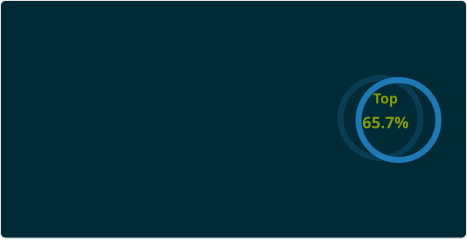
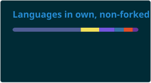

### Hey there! 👋🏻🖖🏻🥳

🔭 Constantly working on being best papa in the world & [TZN Flake](../../../tzn-flake) during rare minutes of leasure time.

🌱 Currently learning home automation via Home Assistant with [EnOcean](https://github.com/henningkerstan/enocean-async) hardware & still struggling with Python's syntax, especiall its "no curly braces, at all" philosophy.

👯 Looking to collaborate on a Blazor-based CMS that could replace WordPress.

🤔 Striving for help with C# P/Invoke regarding FLAC's C++ DLL - about 100 CDs wait for processing them…

💬 Ask me about anything you’d like. Seriously.

📫 How to reach me: e-mail, GitHub or LinkedIn.

😄 Pronouns: he/him, but _human_ is preferred.

⚡ Fun fact: Always be yourself! Unless you can be Batman, then always be Batman. 🦇🤘🏻

